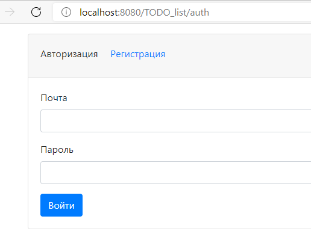
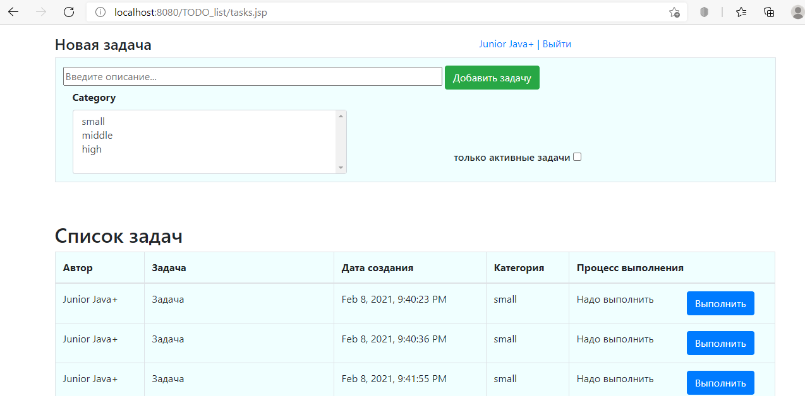
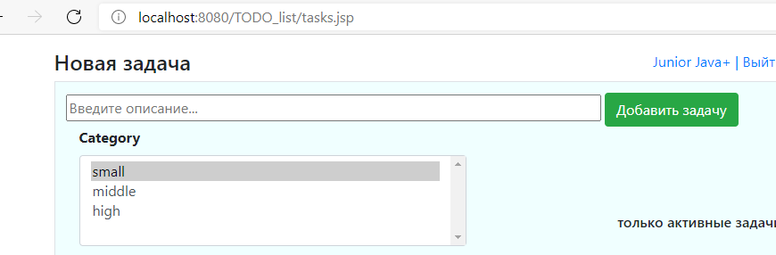
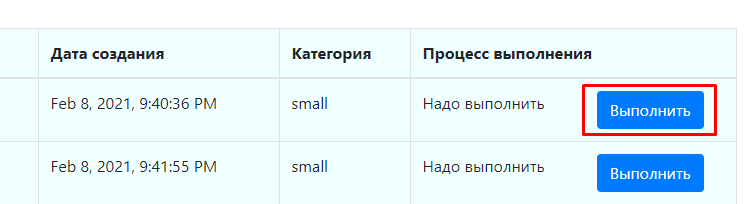
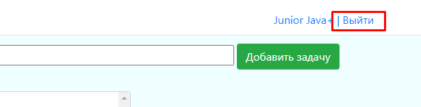

# job4j_todo
### Description of the project.
This project represents the java web technology. This is the first WEB project on ***Hibernate***. Developing the application for learning by using hibernate and servlets. Simple idea realisation of TODO tasks list. If you pass a procedure of registration you give access save Task under your name. There is a list of following opportunities for work with Tasks: create, edit, etc. in your cabinet. On the main page shows whole list of tasks. Log in to the app with a unique username and password. All forms are validated. There are tasks filters: everything, only active tasks.

### Used technologies
- Java EE
- MVC as design pattern.
- Servlet
- Hibernate, DAO pattern
- PostgresSQL
- Front(jsp/jstl/js/HTML/bootstrap/CSS/ajax)
- Jackson for JSON building.
- Tomcat Web server
- Maven as a build system
- CI/CD Travis
- Checkstyle
- Jacoco

### Functionality:
- Authentication.
- Registration.
- Its creator is written in the tasks.
- You can hide completed tasks.
- Easy task creation.
- The added task immediately enters the table on the client && server side.

### Steps of work
After you pushed webapp, you can use it. Steps of work are next:
1. Authorization page
   
   

2. The main page with all the tasks.
   

3. Create the new task
   

4. Complete the task
   

6.Logout

